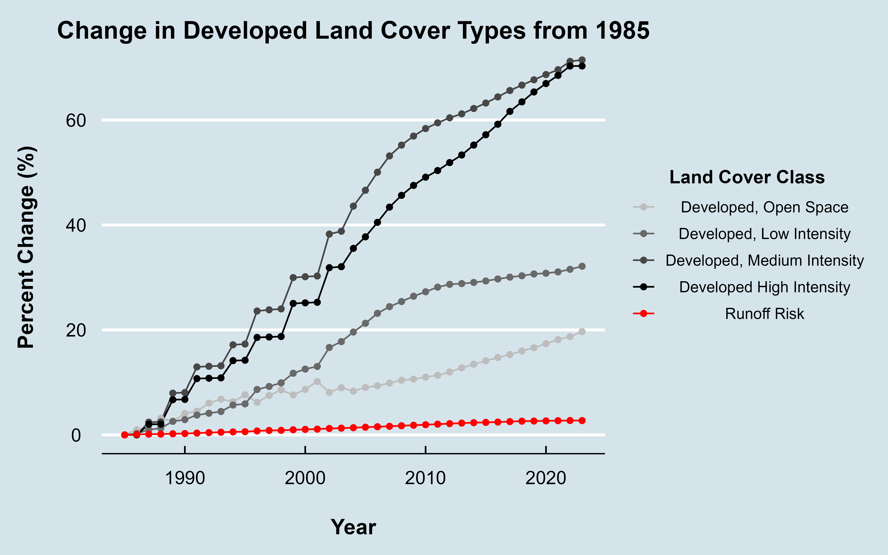
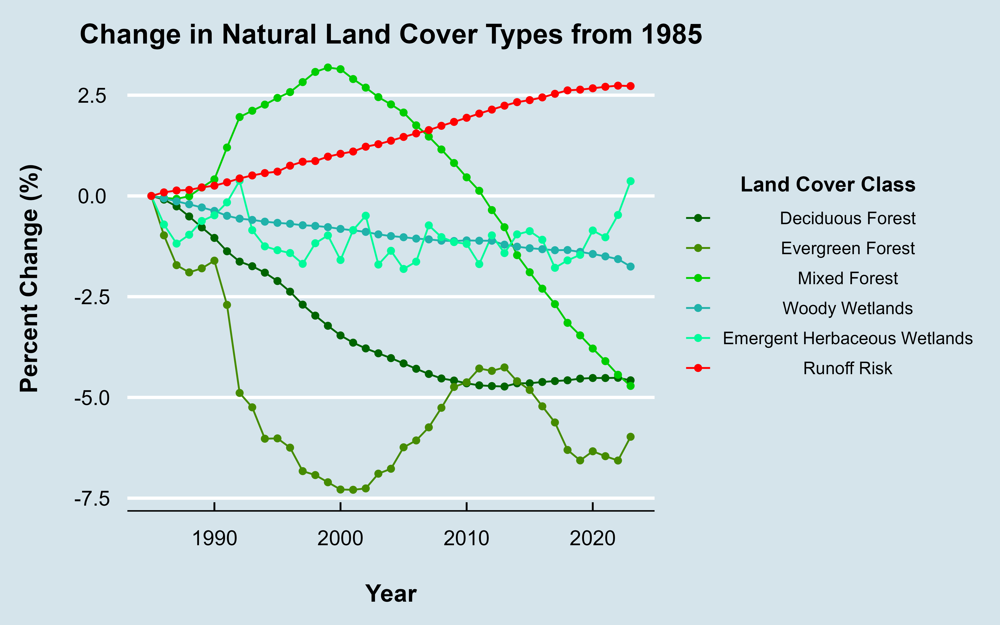
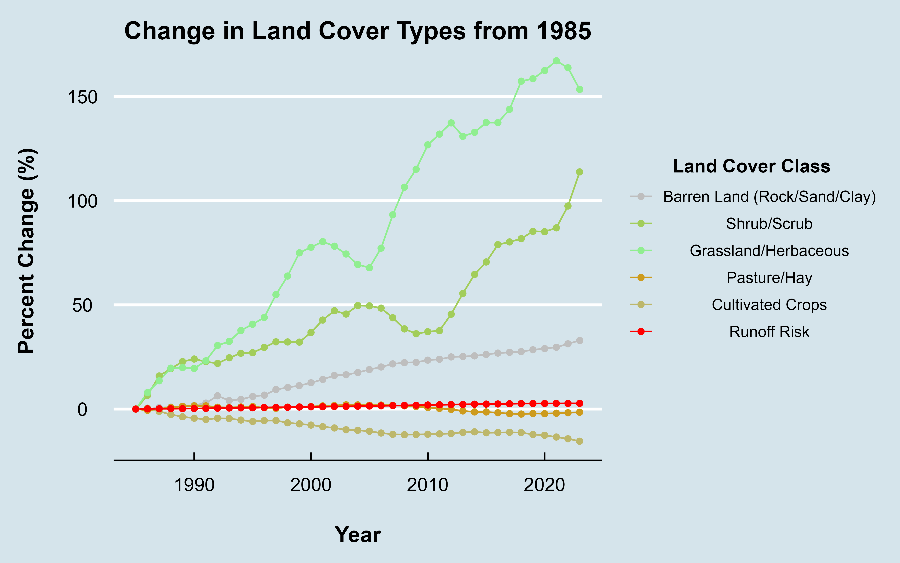

# Chesapeake Bay Watershed Analysis


## Overview

This project is an exploratory data analysis (EDA) of land cover trends and changes in runoff potential within the Chesapeake Bay watershed from 1985 to 2023. The analysis aims to identify trends in land use over time and how it influences runoff potential and, by extension, could impact the environmental health of the watershed.

In this project historical land cover data was examined to observe patterns of urbanization, deforestation, and other changes. Runoff coefficients were assigned for each land cover type. By combining these coefficients with a slope raster, a runoff risk metric was derived that highlights areas with increased potential for runoff over time.

This EDA serves in aiding in the understanding of spatial and temporal changes in watershed dynamics, providing insights that can support future research, policy development, and conservation planning.

## Data

This project used two primary datasets:

1. Digital Elevation Model (DEM), 30-meter resolution DEM obtained from Google Earth Engine.

2. Land Cover Data, A series of 30-meter resolution rasters from the National Land Cover Database (NLCD) for each year from 1985 to 2023.

In total, this analysis worked with 39 raster datasets, one DEM and 38 annual land cover rasters, each clipped to the extent of the Chesapeake Bay Watershed, amounting to about 13 GB of spatial data.

## Methods

Given that both datasets were pre-clipped by the data providers, not much additional preprocessing was required prior to the analysis. However, generating a slope raster, which is critical for calculating runoff potential across the watershed, was needed. This was done using the Slope tool in ArcGIS Pro with the DEM as the input.

Working with approximately 13 GB of raster data can pose as a challenge for full-resolution, time-series analysis. To combat this challenge the majority of the workflow was conducted in a Jupyter Notebook using the `arcpy` and some other libraries. This was more efficient than manullily performing the analysis with ArcGIS, scripting in a Jupyter Notebook and utilizing `arcpy` also gave more control and customization over the workflow of the analysis.

### Calculating Runoff Potential

To calculate runoff potential the following function was used:

 ``` python
def annual_lc_stats(year):
    # load raster for year 
    nlcd_raster = arcpy.Raster(f"nlcd.gdb\Annual_NLCD_LndCov_{year}_CU_C1V0_yVWcgPt3Sk5G0VIKGTWu")
    # reclass with runoff coe as int
    run_coe = arcpy.sa.Reclassify(nlcd_raster, "Value", RemapValue([
        [11, "NODATA"], [12, "NODATA"], [21, 55], [22, 65], [23, 70], 
        [24, 90],[31, 60], [41, 20], [42, 15], [43, 18],
        [51, 5], [52, 25], [71, 35], [72, 35], [73, 15],
        [74, 15], [81, 40], [82, 55], [90, 6], [95, 5]
        ]), "NODATA")

    # land cover stats
    nlcd_table = f".\outputs.gdb\lc_stats_{year}"
    nlcd_results_table = arcpy.ia.SummarizeCategoricalRaster(nlcd_raster, nlcd_table)
    arcpy.conversion.TableToTable(nlcd_results_table, "out_puts", f"lc_stats_{year}.csv")
    # make int into floats
    run_coe = run_coe * 0.01
    # calc runoff profile with (run_coe * slope) 
    runoff_profile = run_coe * slope

    del run_coe
    # save runoff profile
    runoff_profile.save(f".\outputs.gdb\RunoffPr{year}")
    # get stats for each land cover type, save table, can be used later for more stat analysis
    out_table = f".\outputs.gdb\runoff_stats_{year}"
    results_table = arcpy.sa.ZonalStatisticsAsTable(nlcd_raster, "Value", runoff_profile, out_table)
    arcpy.conversion.TableToTable(results_table, ".\out_puts", f"runoff_stats_{year}.csv")
    # clean env
    del nlcd_raster, runoff_profile, out_table, results_table, nlcd_table, nlcd_results_table
    gc.collect()
   
```

The function works by first loading in a land cover raster based on the year input. Then the land cover raster is reclassified with the runoff coefficients which is then multiplied against the slope raster to get the runoff potential. Zonal statistics of the runoff potential are taken using the land cover raster classes as zones. Finally the outputs are saved and the function ends.

### Land Cover analysis

To analysis land cover changes between years the following methods were used:

``` python
# load in rasters and convert to array
lc_1985 = arcpy.Raster("nlcd.gdb\Annual_NLCD_LndCov_1985_CU_C1V0_yVWcgPt3Sk5G0VIKGTWu")
lc_1985_arr = arcpy.RasterToNumPyArray(lc_1985)
del lc_1985
lc_2004 = arcpy.Raster("nlcd.gdb\Annual_NLCD_LndCov_2004_CU_C1V0_yVWcgPt3Sk5G0VIKGTWu")
lc_2004_arr = arcpy.RasterToNumPyArray(lc_2004)
del lc_2004
lc_2023 = arcpy.Raster("nlcd.gdb\Annual_NLCD_LndCov_2023_CU_C1V0_yVWcgPt3Sk5G0VIKGTWu")
lc_2023_arr = arcpy.RasterToNumPyArray(lc_2023)
del lc_2023

# compare rasters 
def compare_rasters(arr1, arr2):
    changes = list(zip(arr1.flatten(), arr2.flatten()))
    return Counter(changes)

# apply function
transitions_1985_2004 = compare_rasters(lc_1985_arr, lc_2004_arr)
transitions_2004_2023 = compare_rasters(lc_2004_arr, lc_2023_arr)

# transform to dataframe
def counter_to_dataframe(counter):
    df = pd.DataFrame(list(counter.items()), columns=["Transition", "Count"])
    df[["From", "To"]] = pd.DataFrame(df["Transition"].tolist(), index=df.index)
    return df.drop(columns="Transition")

# apply function
df_85_04 = counter_to_dataframe(transitions_1985_2004)
df_04_23 = counter_to_dataframe(transitions_2004_2023)

# save outputs
df_85_04.to_csv(".\out_puts\lc_t_1985_2004.csv", index=False)
df_04_23.to_csv(".\out_puts\lc_t_2004_2023.csv", index=False)

```

Land cover change is found by comparing the rasters as arrays and counting the changes between classes from year to year. This was done for 1985 to 2004 and 2004 to 2023.

## Results

The results from the analysis show an increase in runoff potential from 1985 to 2023.


As seen in the map above, the difference in runoff potential from 1985 to 2023, these are large areas of increasing runoff potential around cities/urban areas.

When looking at this on a land cover level, it can be seen that man-made land cover classes are increasing over this period while natural classes are decreasing and runoff risk/potential is steadily rising. This can be seen in the charts below.


This chart shows the change in man-made/developed land cover types from 1985 to 2023.



This chart shows the change in natural land cover types from 1985 to 2023.



This chart shows the change in various other land cover types from 1985 to 2023. It can be seen that agricultural land cover types have been decreasing while runoff risk is rising.



A closer examination of these trends can be seen when looking at year to year change between land cover classes.


The diagram above clearly shows a trend of increasing developed areas and decreasing forested areas. This trend can also be seen spatially. The map below shows areas that either change from natural to developed (red) or from developed to natural (green). It can be clearly seen that the majority of change is from natural or developed and most of this change happened around cities/urban areas.


## Discussion

Based on the results of the analysis, developed land cover types were observed to be increasing, often replacing natural areas such as forests and wetlands. This trend of urbanization is the most likely driver behind the increasing runoff potential in the watershed, as impervious surfaces like roads and buildings contribute significantly to surface runoff.

Interestingly, while cropland area declined over time, runoff potential still increased. This suggests that although the physical extent of agriculture has decreased, the intensity of land use—such as fertilizer application and chemical inputs—may still pose serious ecological risks. This highlights an important distinction: the quality of runoff, not just its quantity or modeled potential, plays a critical role in environmental impact. Future work should incorporate water quality data to fully assess agricultural contributions to watershed degradation.

## Conclusion

This project found that runoff potential within the Chesapeake Bay Watershed has been increasing from 1985 to 2023, primarily due to the expansion of developed and urban areas. Using a combination of land cover classification, slope analysis, and runoff coefficients, we were able to model spatial patterns in runoff risk and land cover changes.

The findings show the growing impact of urbanization on watershed dynamics and suggest that both land use planning and agricultural management strategies are essential to mitigating future runoff related issues. This exploratory analysis provides an introduction for more detailed hydrological and water quality studies and can inform policy decisions for better protecting the health of the Chesapeake Bay Watershed.

## Sources

Fisheries, NOAA. “Chesapeake Bay.” NOAA, www.fisheries.noaa.gov/topic/chesapeake-bay. Accessed 21 Apr. 2025. 

“The Issues.” Chesapeake Bay Foundation, www.cbf.org/issues/. Accessed 23 Apr. 2025. 
Virginia, www.vdot.virginia.gov/media/vdotvirginiagov/doing-business/technical-guidance-and-support/technical-guidance-documents/location-and-design/migrated/drainagemanual/chapter3_acc10172023_PM.pdf. Accessed 25 Apr. 2025.

“Learn Stormwater Studio.” Learn Stormwater Studio, 20 Oct. 2017, learn.hydrologystudio.com/stormwater-studio/knowledge-base/runoff-coefficients/. Accessed 03 Apr. 2025.

Modelling Hydrologic Regime of Lakshmanatirtha Watershed, Cauvery River | IEEE Conference Publication | IEEE Xplore, ieeexplore.ieee.org/document/6967560/. Accessed 20 Apr. 2025.

Runoff Coefficients | Download Table, www.researchgate.net/figure/RUNOFF-COEFFICIENTS_tbl3_266319187. Accessed 17 Apr. 2025.
